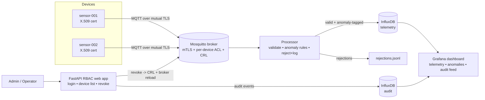

# Secure IoT Monitoring Platform

A monitoring platform for IoT sensor fleets built security-first: every device
has its own cryptographic identity, all traffic is encrypted, access is
role-controlled, every security action is audited, and credentials can be
revoked in real time. Ships with a **deliberately insecure twin** and an
automated attack runner that proves each defense by showing the same attack
succeed on the insecure stack and fail on the secure one.

## Why this project
Most IoT dashboards *display* data. This one *monitors* it — the difference is
per-device identity, transport encryption, RBAC, a queryable audit trail, and
live credential revocation. The insecure-vs-secure demo makes each security
property falsifiable rather than asserted.

## Architecture



## Security features
- **Per-device identity** — every device authenticates with its own X.509
  client certificate; the certificate CN *is* the device identity. No shared
  passwords anywhere.
- **Encrypted transport** — MQTT over mutual TLS (TLS 1.3); the broker refuses
  any client without a CA-signed certificate.
- **Per-device isolation** — an ACL confines each device to its own topic
  subtree; a compromised device cannot impersonate another.
- **Validation + anomaly detection** — the processor validates schema, types,
  and physical ranges; anomalies are stored and flagged, malformed/unauthorized
  messages are rejected and logged (never silently dropped).
- **RBAC** — operator (view-only) vs admin (can revoke), enforced server-side.
- **Live credential revocation** — CRL-backed; an admin revokes a device via the
  UI and it is locked out of the broker in real time. The UI cannot show
  "revoked" unless the CRL actually contains the device (verified, not assumed).
- **Audit logging** — every login, access attempt, config change, and
  revocation is written to a dedicated, queryable audit store.
- **Observability** — a Grafana dashboard shows live telemetry, highlighted
  anomalies, and a live security audit feed.

## Threat model

| Asset | Attacker | Attack | Impact | Mitigation |
|---|---|---|---|---|
| Telemetry integrity | Network attacker | Spoofed sensor (no/forged identity) | Poisoned data drives bad decisions | mTLS + per-device certs; broker requires CA-signed cert; processor rejects `device_id` ≠ topic |
| Device isolation | Compromised device | Cross-device impersonation | One breach forges the fleet | Per-device ACL confines each identity to its own topic |
| Data pipeline | Malicious publisher | Malformed / injection | Crash processing, hide real signals | Strict validation; rejected messages logged, not dropped |
| Credential lifecycle | Attacker with stolen key | Stolen credential reuse | Persistent unauthorized access | CRL enforced by broker; live admin revocation |
| Availability | Any client | DoS / flooding | Broker overload | Auth raises connection cost; targeted revocation *(rate-limiting: future work)* |
| Firmware/config | Insider / MITM | Malicious firmware push | Attacker controls devices | Command topics under same mTLS + ACL; all actions audited *(signed firmware: future work)* |
| Access control | Insider operator | Privilege escalation | Unauthorized revocation | RBAC enforced server-side; forbidden attempts audited |
| Auditability | Any actor | Repudiation | No accountability | Append-only audit store for all security events |

## Measured metrics
Measured on a single laptop, secure stack (mTLS + ACL), one publisher:

| Metric | Result | How measured |
|---|---|---|
| Throughput | **~1,700 msg/s** | 100 QoS-1 messages published over mTLS (`demo/measure_metrics.py`) |
| Alert latency (publish → queryable) | **sub-second (~1s end-to-end)** | unique message published, polled in InfluxDB until visible |
| Unauthorized messages blocked | **100%** in testing | attack runner (2/2) + rejection audit log |
| Recovery after revocation | **seconds** (broker CRL reload) | revoke → device locked out on reconnect |

## Insecure-vs-secure demonstration
The `insecure/` stack is the same system with TLS, per-device auth, and the ACL
removed. `demo/attack_runner.py` runs each attack against both stacks:

```
== Attack 1: Anonymous publish (no credentials) ==
  INSECURE (1883): SUCCEEDED
  SECURE   (8883): BLOCKED
== Attack 2: Cross-device spoofing (ACL bypass attempt) ==
  INSECURE (1883): message DELIVERED to victim topic
  SECURE   (8883): message BLOCKED by ACL
Summary: 2/2 attacks blocked on secure, succeed on insecure.
```

> Demo video: https://youtu.be/o3JpkNYN8gE

## Tech stack
Mosquitto (MQTT broker) · Python (paho-mqtt, FastAPI) · InfluxDB (time-series +
audit) · Grafana (dashboard) · OpenSSL (PKI/CRL) · Docker Compose.

## Quick start
```bash
# 1. Generate the CA, broker cert, and per-device certs (Git Bash on Windows)
bash certs/generate_ca_and_server.sh
bash certs/provision_device.sh sensor-001
bash certs/provision_device.sh sensor-002
bash certs/provision_device.sh processor
bash certs/rebuild_ca_db.sh          # sets up the CRL database

# 2. Configure secrets
cp .env.example .env                 # then set real tokens/passwords in .env

# 3. Bring up the secure stack (broker + InfluxDB + Grafana)
docker compose up -d

# 4. Install Python deps and run the services
python -m venv .venv && source .venv/Scripts/activate   # Windows Git Bash
pip install -r processor/requirements.txt -r webapp/requirements.txt -r simulator/requirements.txt
python processor/processor.py                 # terminal 1
python simulator/device_simulator.py --device sensor-001 --mode normal   # terminal 2
python -m uvicorn webapp.app:app --port 8000  # terminal 3
```
- Dashboard: http://localhost:3000 (Grafana)
- Admin UI: http://localhost:8000 (operator/operator123 · admin/admin123)
- InfluxDB: http://localhost:8086

### Run the attack demo
```bash
docker compose -f insecure/docker-compose.insecure.yml up -d
python demo/attack_runner.py
```

## Simulator modes
`--mode normal | anomaly | malformed | spoof` — generate clean data, out-of-band
anomalies, malformed payloads, or identity-spoofing attempts.

## Project status
- [x] Phase 1 — Broker & Identity (mTLS, per-device certs, ACL isolation)
- [x] Phase 2 — Processing & Storage (validation, anomaly flagging, rejection log, InfluxDB)
- [x] Phase 3 — Access Control & Observability (RBAC, audit log, CRL revocation, Grafana)
- [x] Phase 4 — Threat Model & Insecure/Secure Demo

## Notes & future work
- Rate-limiting for DoS resistance; signed-firmware verification for update integrity.
- Demo credentials are seeded for convenience — replace for any real deployment.